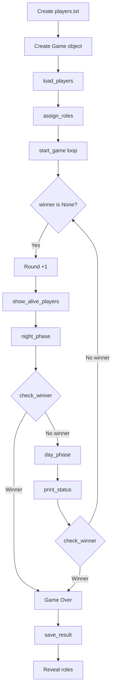

# 🐺 Werewolf Game Simulator

> A Python-based text simulation of the classic Werewolf (Mafia) party game.
> Built as an academic project for Object-Oriented Programming with Python.

---

## 📋 Table of Contents

- [About The Project](#-about-the-project)
- [The Story](#-the-story)
- [Game Rules](#-game-rules)
- [Built With](#-built-with)
- [Project Structure](#-project-structure)
- [Class Design](#-class-design)
- [Game Flow](#-game-flow)
- [Special Events](#-special-events)
- [File Handling](#-file-handling)
- [How to Run](#-how-to-run)
- [Sample Output](#-sample-output)
- [Reflection](#-reflection)
- [Mark Distribution](#-mark-distribution)
- [Author](#-author)

---

## 🎯 About The Project

This project simulates a **Werewolf Game** where a village of 8 players secretly hides 2 Werewolves. Each round consists of a **Night Phase** (Werewolves attack) and a **Day Phase** (Villagers vote). The game runs automatically until one side wins.

**Key Features:**

- Object-Oriented Programming with 2 classes (`Player` & `Game`)
- Random role assignment using Python's `random` module
- File reading (`players.txt`) and file writing (`game_result.txt`)
- 2 original custom events for added excitement
- Clean console output for easy game tracking

---

## 📖 The Story

> A peaceful village is hiding a dangerous secret._
>
> Among the villagers, two players are secretly **Werewolves**. Every night, the Werewolves attack a villager. During the day, the villagers try to guess who the Werewolves are and remove that player from the village. The villagers know that danger exists, but they do not know who the Werewolves are.
>
> The game continues until **both Werewolves are eliminated** — or the **Werewolves overrun the village**.

---

## ⚖️ Game Rules

| Rule                           | Description                     |
| ------------------------------ | ------------------------------- |
| **Players**                    | 8 players total                 |
| **Werewolves**                 | 2 players randomly assigned     |
| **Villagers**                  | Remaining 6 players             |
| **Win Condition (Villagers)**  | Both Werewolves eliminated      |
| **Win Condition (Werewolves)** | Werewolves ≥ Villagers in count |

---

## 🛠 Built With

- **Language:** Python 3
- **Environment:** Jupyter Notebook (`.ipynb`)
- **Modules:** `random` (built-in)

---

## 📁 Project Structure

```
werewolf-game-simulator/
│
├── 21201063.ipynb          # Main notebook with all code
├── players.txt             # Input file (8 player names)
├── game_result.txt         # Output file (game outcome)
├── README.md               # This file
├── game_explanation.md     # Complete beginner's guide (English)
└── game_explanation_bn.md  # Complete beginner's guide (Bangla)
```

---

## 🧩 Class Design

### `Player` Class

| Attribute | Type    | Description                      |
| --------- | ------- | -------------------------------- |
| `name`    | string  | The player's name                |
| `role`    | string  | "Werewolf" or "Villager"         |
| `alive`   | boolean | `True` if alive, `False` if dead |

| Method           | Description                   |
| ---------------- | ----------------------------- |
| `display_info()` | Prints name, role, and status |
| `eliminate()`    | Marks the player as dead      |

### `Game` Class

| Attribute          | Type | Description                          |
| ------------------ | ---- | ------------------------------------ |
| `players`          | list | List of all `Player` objects         |
| `round_number`     | int  | Current round counter                |
| `eliminated_order` | list | Names of eliminated players in order |

| Method                  | Description                                    |
| ----------------------- | ---------------------------------------------- |
| `load_players()`        | Reads `players.txt` and creates Player objects |
| `assign_roles()`        | Randomly assigns 2 Werewolves, rest Villagers  |
| `get_alive_players()`   | Returns list of alive players                  |
| `count_alive_by_role()` | Counts alive players by a specific role        |
| `show_alive_players()`  | Prints all alive players                       |
| `night_phase()`         | Werewolves attack a random Villager            |
| `day_phase()`           | Villagers vote to eliminate a player           |
| `check_winner()`        | Checks if game over, returns winner or `None`  |
| `save_result()`         | Writes game outcome to `game_result.txt`       |
| `print_status()`        | Prints current Villager/Werewolf counts        |
| `start_game()`          | Main game loop that runs everything            |

---

## 🔄 Game Flow

```
START
  │
  ├── 1. Create players.txt (8 names)
  ├── 2. Create Game object
  ├── 3. Load players from file
  ├── 4. Assign roles (2 Werewolves, 6 Villagers)
  │
  └── 🔁 GAME LOOP (until winner found)
        ├── Round N begins
        ├── Show alive players
        ├── 🌙 NIGHT PHASE
        │     ├── Find alive Werewolves
        │     ├── Find alive Villagers
        │     ├── 10% chance → Lucky Escape (no death)
        │     └── 90% chance → Attack a random Villager
        ├── Check for winner
        ├── ☀️ DAY PHASE
        │     ├── 15% chance → Mysterious Clue (eliminate a Werewolf)
        │     └── 85% chance → Vote out a random player
        ├── Print status (Villager/Werewolf counts)
        └── Check for winner
              │
              └── Winner found? → GAME OVER → Save results → Reveal roles
```

### Visual Flowchart



---

## ⚡ Special Events

### Event 1: Lucky Escape 🍀

| Property    | Details                                                |
| ----------- | ------------------------------------------------------ |
| **Phase**   | Night                                                  |
| **Chance**  | 10%                                                    |
| **Effect**  | The targeted Villager escapes. Nobody dies that night. |
| **Trigger** | `random.randint(1, 100) <= 10`                         |

### Event 2: Mysterious Clue 🔍

| Property      | Details                                                    |
| ------------- | ---------------------------------------------------------- |
| **Phase**     | Day                                                        |
| **Chance**    | 15%                                                        |
| **Effect**    | Villagers find evidence and directly eliminate a Werewolf. |
| **Trigger**   | `random.randint(1, 100) <= 15`                             |
| **Condition** | At least one Werewolf must be alive                        |

---

## 📂 File Handling

### Input: `players.txt`

```
Alice
Bob
Charlie
David
Emma
Frank
Grace
Henry
```

- Created automatically by the notebook
- One name per line

### Output: `game_result.txt`

```
=== WEREWOLF GAME RESULT ===
Winner: Werewolves
Total Rounds: 4

--- Surviving Players ---
Charlie (Villager)
Grace (Werewolf)

--- Eliminated Players (in order) ---
Alice
Emma
Frank
Henry
Bob
David
```

---

## 🚀 How to Run

### Prerequisites

- Python 3.x installed
- Jupyter Notebook / JupyterLab / VS Code

### Steps

1. **Clone or download** this repository
2. Open the notebook file:
   ```
   21201063.ipynb
   ```
3. **Run all cells** in order (from top to bottom)
4. Watch the game simulation play out in the console output
5. Check `game_result.txt` for the final results

> No external packages required — only Python's built-in `random` module is used.

---

## 🖥 Sample Output

```
==================================================
WEREWOLF GAME SIMULATOR
==================================================

########################################
### Round 1 ###
########################################

Alive Players (8):
  - Alice
  - Bob
  - Charlie
  - David
  - Emma
  - Frank
  - Grace
  - Henry

----------------------------------------
Night 1
The village sleeps...
----------------------------------------
Werewolves attacked Alice.
Alice has been eliminated.

----------------------------------------
Day 1
The village discusses...
----------------------------------------
Villagers voted against Emma.
Emma was eliminated.

Current Status:
  Villagers: 5
  Werewolves: 1

... (rounds continue until a winner is found) ...

==================================================
GAME OVER!
Winner: WEREWOLVES
==================================================

--- Final Role Reveal ---
Alice - Villager (Eliminated)
Bob - Villager (Eliminated)
Charlie - Villager (Alive)
...
Grace - Werewolf (Alive)
```

---

## 💭 Reflection

### Which part was the hardest?

Understanding the game-ending condition was tricky. Initially I checked if all villagers were dead, but the actual rule is that Werewolves win when their count equals or exceeds the Villagers. Reading the requirements carefully helped me fix this.

### What bug/problem did you face?

The game crashed during the night phase when no Werewolves were alive — the code tried to pick an attacker but found none. I fixed it by adding a safety check at the start of `night_phase()` that returns early if no Werewolves exist.

### What did you learn from this assignment?

I learned how to use classes in Python for a real project, separate logic into different methods, handle file I/O (reading and writing text files), and use the `random` module for unpredictability. This was my first time building an object-oriented program from scratch.

### What would you improve later?

I would add more roles (Doctor, Seer), make the game interactive (user input instead of auto-simulation), and build a graphical interface with `tkinter` or a web frontend.

---

## 📊 Mark Distribution

| Section                      | Marks  |
| ---------------------------- | ------ |
| Class Design and OOP         | 5      |
| Random Module Usage          | 4      |
| File Handling                | 4      |
| Game Logic                   | 4      |
| Creativity and Custom Events | 2      |
| Reflection Section           | 1      |
| **Total**                    | **20** |

---

## 👤 Author

**Name:** [Your Full Name]  
**Student ID:** 21201063  
**Course:** Object-Oriented Programming (Python)  
**Environment:** Jupyter Notebook  
**Language:** Python 3

---

## 📄 License

This project is submitted as an academic assignment. All code is original work.

---

> _"A peaceful village is hiding a dangerous secret..."_
