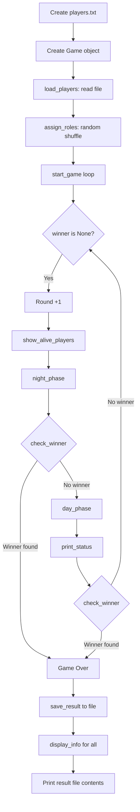

# 🐺 Werewolf Game Simulator — Complete Beginner's Guide

> This document explains **every single line** of code in the Werewolf Game Simulator.
> After reading this, you will understand what each class does, what each method does,
> what each line of code does, and how the whole game flows from start to finish.

---

## Table of Contents

1. [What This Program Does (Overview)](#1-what-this-program-does-overview)
2. [The Game Story (Pipeline)](#2-the-game-story-pipeline)
3. [Modules Used](#3-modules-used)
4. [Player Class — Line by Line](#4-player-class--line-by-line)
5. [Game Class — Line by Line](#5-game-class--line-by-line)
6. [The Main Execution Code — Line by Line](#6-the-main-execution-code--line-by-line)
7. [File Handling](#7-file-handling)
8. [Special Events Explained](#8-special-events-explained)
9. [Complete Execution Flow (Walkthrough)](#9-complete-execution-flow-walkthrough)

---

## 1. What This Program Does (Overview)

This is a **text-based simulation** of the party game "Werewolf" (also known as "Mafia").

- There are **8 players** in the village.
- **2 players** are secretly **Werewolves**. The other **6** are **Villagers**.
- Each round has two phases:
  - **Night**: The Werewolves secretly kill one Villager.
  - **Day**: The Villagers vote to eliminate one player (they don't know who the Werewolves are).
- The game ends when either:
  - **Villagers win**: Both Werewolves are eliminated.
  - **Werewolves win**: The number of Werewolves equals or exceeds the number of Villagers.

The program reads player names from a file (`players.txt`), simulates the entire game automatically, and writes the result to another file (`game_result.txt`).

---

## 2. The Game Story (Pipeline)

Here is the **step-by-step pipeline** of how the game runs:

```
┌─────────────────────────────────────────────┐
│  STEP 1: Create players.txt with 8 names    │
├─────────────────────────────────────────────┤
│  STEP 2: Create a Game object               │
├─────────────────────────────────────────────┤
│  STEP 3: Load players from file into memory │
├─────────────────────────────────────────────┤
│  STEP 4: Assign roles (2 Werewolves, 6      │
│           Villagers) randomly               │
├─────────────────────────────────────────────┤
│  STEP 5: Start the main game loop           │
│           ┌──────────────────────────┐      │
│           │  ROUND N BEGINS          │      │
│           ├──────────────────────────┤      │
│           │  Show alive players      │      │
│           ├──────────────────────────┤      │
│           │  NIGHT PHASE             │      │
│           │    - Werewolves pick a   │      │
│           │      random Villager     │      │
│           │    - 10% chance: Lucky   │      │
│           │      Escape (no death)   │      │
│           ├──────────────────────────┤      │
│           │  Check if game is over   │      │
│           ├──────────────────────────┤      │
│           │  DAY PHASE               │      │
│           │    - 15% chance:         │      │
│           │      Mysterious Clue     │      │
│           │      (eliminate a wolf)  │      │
│           │    - Otherwise: random   │      │
│           │      player is voted out │      │
│           ├──────────────────────────┤      │
│           │  Print status (counts)   │      │
│           ├──────────────────────────┤      │
│           │  Check if game is over   │      │
│           └──────────────────────────┘      │
│           ↑ Repeat until winner found  ↑    │
├─────────────────────────────────────────────┤
│  STEP 6: Announce winner                    │
├─────────────────────────────────────────────┤
│  STEP 7: Save results to game_result.txt    │
├─────────────────────────────────────────────┤
│  STEP 8: Reveal all players' roles          │
├─────────────────────────────────────────────┤
│  STEP 9: Display game_result.txt contents   │
└─────────────────────────────────────────────┘
```

### Visual Flow Diagram



---

## 3. Modules Used

### `random`

```python
import random
```

This is Python's built-in module for generating random numbers and making random choices. We use it for:

| Function Used            | What It Does                             | Where Used                                  |
| ------------------------ | ---------------------------------------- | ------------------------------------------- |
| `random.shuffle(list)`   | Randomly reorders a list in place        | Assigning roles                             |
| `random.choice(list)`    | Picks one random item from a list        | Picking attack target, picking vote suspect |
| `random.randint(1, 100)` | Picks a random integer between 1 and 100 | Checking event chances (10%, 15%)           |

---

## 4. Player Class — Line by Line

The `Player` class is the **blueprint for a single player**. Each player is an "object" with a name, a role, and a status (alive or not).

### Class Declaration

```python
class Player:
```

This line says: "We are creating a new type of object called `Player`."

### `__init__` Method (Constructor)

```python
def __init__(self, name, role):
```

| Part       | Meaning                                                                                                          |
| ---------- | ---------------------------------------------------------------------------------------------------------------- |
| `def`      | We are defining a function/method                                                                                |
| `__init__` | This is a special method that runs automatically when we create a new `Player`. It's called the **constructor**. |
| `self`     | Refers to the **specific player object** we are creating right now                                               |
| `name`     | The player's name (e.g., `"Alice"`), passed in when creating the player                                          |
| `role`     | The player's role (e.g., `"Werewolf"`), passed in when creating the player                                       |

```python
        self.name = name
```

**What this does:** Stores the player's name inside the object. `self.name` means "this specific player's name." So if we create `Player("Alice", "Villager")`, then `self.name` becomes `"Alice"`.

```python
        self.role = role
```

**What this does:** Stores the player's role inside the object.

```python
        self.alive = True
```

**What this does:** Every player starts **alive**. This is a boolean variable (True/False). When a player is eliminated, this changes to `False`.

---

### `display_info` Method

```python
    def display_info(self):
```

| Part           | Meaning                                              |
| -------------- | ---------------------------------------------------- |
| `def`          | Defining a method                                    |
| `display_info` | The name of the method                               |
| `self`         | Refers to the player object this method is called on |

```python
        status = "Alive"
```

**What this does:** Creates a variable called `status` and sets it to `"Alive"` by default.

```python
        if self.alive == False:
            status = "Eliminated"
```

**What this does:** Checks if the player is dead. The `==` operator checks for equality. If `self.alive` is `False`, it changes `status` to `"Eliminated"`.

```python
        print(self.name + " - " + self.role + " (" + status + ")")
```

**What this does:** Prints a line like `"Alice - Villager (Alive)"`. The `+` operator joins (concatenates) strings together.

**Example output:** `Alice - Werewolf (Eliminated)`

---

### `eliminate` Method

```python
    def eliminate(self):
```

**What this does:** Defines a method called `eliminate` that will "kill" this player.

```python
        self.alive = False
```

**What this does:** Changes the player's `alive` status from `True` to `False`. This is how we mark a player as dead.

```python
        print(self.name + " has been eliminated.")
```

**What this does:** Prints a message announcing the elimination. For example: `"Alice has been eliminated."`

---

## 5. Game Class — Line by Line

The `Game` class is the **brain of the entire program**. It controls everything: loading players, assigning roles, running phases, checking for a winner, and saving results.

### `__init__` Method (Constructor)

```python
class Game:
    def __init__(self):
        self.players = []
        self.round_number = 0
        self.eliminated_order = []
```

| Line                         | What It Does                                                                                                 |
| ---------------------------- | ------------------------------------------------------------------------------------------------------------ |
| `self.players = []`          | Creates an **empty list** to store all Player objects. We will fill this later when we read the file.        |
| `self.round_number = 0`      | Starts the round counter at 0. It increases by 1 each round.                                                 |
| `self.eliminated_order = []` | Creates an empty list that will store the names of eliminated players **in the order they were eliminated**. |

---

### `load_players` Method

```python
    def load_players(self, filename):
```

**Purpose:** Read player names from a text file and create `Player` objects for each name.

```python
        print("Loading players from " + filename + "...")
```

**What this does:** Prints a status message so the user knows what's happening.

```python
        file = open(filename, "r")
```

**What this does:** Opens the file in **read mode** (`"r"`). The variable `file` now holds a connection to the file on disk.

```python
        for line in file:
```

**What this does:** A `for` loop that reads the file **one line at a time**. Each time through the loop, `line` contains one line from the file (e.g., `"Alice\n"`).

```python
            name = line.strip()
```

**What this does:** `.strip()` removes any extra whitespace from the line, especially the newline character (`\n`) at the end. So `"Alice\n"` becomes `"Alice"`.

```python
            if name != "":
```

**What this does:** Skips empty lines. If the file has a blank line, we ignore it.

```python
                player = Player(name, "Unassigned")
```

**What this does:** Creates a **new Player object** with the given name and a temporary role of `"Unassigned"`. The role will be set properly later.

```python
                self.players.append(player)
```

**What this does:** Adds the newly created Player object to the `self.players` list. `.append()` adds an item to the end of a list.

```python
        file.close()
```

**What this does:** Closes the file. It's important to close files when you're done reading them.

```python
        print("Loaded " + str(len(self.players)) + " players.")
```

**What this does:** Prints how many players were loaded. `len()` returns the number of items in a list. `str()` converts the number to a string so it can be printed.

---

### `assign_roles` Method

```python
    def assign_roles(self):
```

**Purpose:** Randomly pick 2 players to be Werewolves. Everyone else becomes a Villager.

```python
        print("\nAssigning roles randomly...")
```

**What this does:** Prints a message. `\n` adds a blank line before the message.

```python
        shuffled = list(self.players)
```

**What this does:** Creates a **copy** of the players list. `list()` creates a new list with the same items. We copy it because `shuffle` changes the list and we want to keep the original order.

```python
        random.shuffle(shuffled)
```

**What this does:** Randomly reorders (shuffles) the copied list. After this, the players are in a random order.

```python
        for i in range(len(shuffled)):
```

**What this does:** A loop that goes through each index of the shuffled list. `range(len(shuffled))` generates numbers `0, 1, 2, 3, 4, 5, 6, 7` (for 8 players).

```python
            if i < 2:
                shuffled[i].role = "Werewolf"
            else:
                shuffled[i].role = "Villager"
```

**What this does:**

- If the index (`i`) is 0 or 1, that player becomes a Werewolf.
- If the index is 2 or higher, that player becomes a Villager.
- Because the list is shuffled, the 2 Werewolves are chosen randomly.

```python
        print("Roles have been assigned. (Shh... it's a secret!)")
```

**What this does:** Confirms roles are set. The roles are secret — the program doesn't show them until the end.

---

### `get_alive_players` Method (Helper)

```python
    def get_alive_players(self):
        alive_list = []
        for player in self.players:
            if player.alive == True:
                alive_list.append(player)
        return alive_list
```

| Line                          | What It Does                                       |
| ----------------------------- | -------------------------------------------------- |
| `alive_list = []`             | Creates an empty list to collect alive players.    |
| `for player in self.players:` | Loops through **every** player in the game.        |
| `if player.alive == True:`    | Checks if this player is still alive.              |
| `alive_list.append(player)`   | If alive, adds them to our result list.            |
| `return alive_list`           | Sends the list back to whoever called this method. |

---

### `count_alive_by_role` Method (Helper)

```python
    def count_alive_by_role(self, role):
        count = 0
        for player in self.players:
            if player.alive == True and player.role == role:
                count = count + 1
        return count
```

| Line                                               | What It Does                                                                                              |
| -------------------------------------------------- | --------------------------------------------------------------------------------------------------------- |
| `count = 0`                                        | Starts the counter at zero.                                                                               |
| `for player in self.players:`                      | Checks every player.                                                                                      |
| `if player.alive == True and player.role == role:` | Two conditions must both be true: (1) player is alive, AND (2) player's role matches what we're counting. |
| `count = count + 1`                                | Increases the counter by 1 when we find a match.                                                          |
| `return count`                                     | Returns the final count.                                                                                  |

**Example:** `self.count_alive_by_role("Werewolf")` returns `2` if both werewolves are still alive.

---

### `show_alive_players` Method

```python
    def show_alive_players(self):
        alive = self.get_alive_players()
        print("\nAlive Players (" + str(len(alive)) + "):")
        for player in alive:
            print("  - " + player.name)
```

| Line                               | What It Does                                                 |
| ---------------------------------- | ------------------------------------------------------------ |
| `alive = self.get_alive_players()` | Calls the helper method to get the list of alive players.    |
| `print(...)`                       | Prints a header showing how many players are alive.          |
| `for player in alive:`             | Loops through alive players.                                 |
| `print("  - " + player.name)`      | Prints each name with a dash in front (like a bullet point). |

**Example output:**

```
Alive Players (6):
  - Alice
  - Bob
  - Charlie
  - David
  - Emma
  - Frank
```

---

### `night_phase` Method

This is where the Werewolves attack. Let's break it down step by step.

```python
    def night_phase(self):
        print("\n" + "-" * 40)
        print("Night " + str(self.round_number))
        print("The village sleeps...")
        print("-" * 40)
```

| Line                                | What It Does                                                                                                     |
| ----------------------------------- | ---------------------------------------------------------------------------------------------------------------- |
| `"-" * 40`                          | Creates a string of 40 dashes: `"----------------------------------------"`. This is used as a visual separator. |
| `"Night " + str(self.round_number)` | Prints "Night 1", "Night 2", etc.                                                                                |
| `"The village sleeps..."`           | Flavor text to set the mood.                                                                                     |

#### Step 1: Find Alive Werewolves

```python
        alive_wolves = []
        for player in self.players:
            if player.alive == True and player.role == "Werewolf":
                alive_wolves.append(player)
```

**What this does:** Creates a list of all players who are **both** alive **and** Werewolves. This is the "attackers" list.

#### Step 2: Safety Check

```python
        if len(alive_wolves) == 0:
            print("No werewolves are alive. The night is peaceful.")
            return
```

**What this does:** If no werewolves are alive, there's nobody to attack. The `return` statement exits the method immediately.

#### Step 3: Find Alive Villagers

```python
        alive_villagers = []
        for player in self.players:
            if player.alive == True and player.role == "Villager":
                alive_villagers.append(player)
```

**What this does:** Creates a list of all alive Villagers — these are the possible targets.

#### Step 4: Safety Check

```python
        if len(alive_villagers) == 0:
            print("No villagers left to attack.")
            return
```

**What this does:** If there are no villagers to attack, exit the method.

#### Step 5: Pick Random Target

```python
        target = random.choice(alive_villagers)
```

**What this does:** Uses `random.choice()` to randomly pick one Villager from the list. This becomes the attack target.

#### Step 6: Lucky Escape Check

```python
        lucky_chance = random.randint(1, 100)
```

**What this does:** Generates a random number between 1 and 100 (inclusive). This is like rolling a 100-sided die.

```python
        if lucky_chance <= 10:
```

**What this does:** If the number is 10 or less (10% chance), the Lucky Escape event triggers.

```python
            print("\n*** Special Event: Lucky Escape! ***")
            print("The target escaped from the Werewolves.")
            print("Nobody dies tonight.")
```

**What this does:** Prints the special event message. **The target does NOT get eliminated.** The night ends with nobody dying.

```python
        else:
            print("\nWerewolves attacked " + target.name + ".")
            target.eliminate()
            self.eliminated_order.append(target.name)
```

**What this does (the 90% case):**

1. Prints who was attacked.
2. Calls `target.eliminate()` — this sets `target.alive = False` and prints the elimination message.
3. Adds the target's name to `self.eliminated_order` so we can track the order of eliminations.

---

### `day_phase` Method

This is where the Villagers vote to eliminate someone.

```python
    def day_phase(self):
        print("\n" + "-" * 40)
        print("Day " + str(self.round_number))
        print("The village discusses...")
        print("-" * 40)
```

**What this does:** Prints the day phase header with separators.

```python
        alive = self.get_alive_players()
```

**What this does:** Gets the list of all alive players (both Villagers and Werewolves).

```python
        if len(alive) <= 1:
            print("Not enough players for a vote.")
            return
```

**What this does:** If only 0 or 1 players are alive, voting doesn't make sense. Exit the method.

#### Mysterious Clue Check

```python
        clue_chance = random.randint(1, 100)
```

**What this does:** Generates a random number between 1 and 100.

```python
        if clue_chance <= 15:
```

**What this does:** If the number is 15 or less (15% chance), the Mysterious Clue event triggers.

```python
            alive_wolves = []
            for player in alive:
                if player.role == "Werewolf":
                    alive_wolves.append(player)
```

**What this does:** Finds all alive Werewolves from the list of alive players.

```python
            if len(alive_wolves) > 0:
                caught_wolf = random.choice(alive_wolves)
                print("\n*** Special Event: Mysterious Clue! ***")
                print("The villagers found evidence and eliminated a Werewolf.")
                print("Villagers identified " + caught_wolf.name + " as a Werewolf.")
                caught_wolf.eliminate()
                self.eliminated_order.append(caught_wolf.name)
                return
```

| Line                                        | What It Does                                                           |
| ------------------------------------------- | ---------------------------------------------------------------------- |
| `if len(alive_wolves) > 0:`                 | Only trigger if there's actually a werewolf alive.                     |
| `caught_wolf = random.choice(alive_wolves)` | Pick a random werewolf to be "caught."                                 |
| Three print lines                           | Announce the special event.                                            |
| `caught_wolf.eliminate()`                   | Eliminate the caught werewolf.                                         |
| `self.eliminated_order.append(...)`         | Record the elimination.                                                |
| `return`                                    | Exit the method — the day phase is over because a werewolf was caught. |

#### Normal Voting

```python
        suspect = random.choice(alive)
```

**What this does:** If the Mysterious Clue did NOT trigger, randomly pick any alive player as the suspect. (Villagers don't know who the wolves are, so they might vote out a fellow Villager.)

```python
        print("\nVillagers voted against " + suspect.name + ".")
        print(suspect.name + " was eliminated.")
        suspect.eliminate()
        self.eliminated_order.append(suspect.name)
```

| Line                                | What It Does                              |
| ----------------------------------- | ----------------------------------------- |
| Print                               | Announces who was voted against.          |
| Print                               | Announces the elimination.                |
| `suspect.eliminate()`               | Marks the suspect as dead.                |
| `self.eliminated_order.append(...)` | Records the name in order of elimination. |

---

### `check_winner` Method

```python
    def check_winner(self):
        wolf_count = self.count_alive_by_role("Werewolf")
        villager_count = self.count_alive_by_role("Villager")
```

| Line                   | What It Does                            |
| ---------------------- | --------------------------------------- |
| `wolf_count = ...`     | Counts how many alive Werewolves exist. |
| `villager_count = ...` | Counts how many alive Villagers exist.  |

```python
        if wolf_count == 0:
            return "Villagers"
```

**What this does:** If no Werewolves are alive, the Villagers win! Returns the string `"Villagers"`.

```python
        if wolf_count >= villager_count:
            return "Werewolves"
```

**What this does:** If the number of Werewolves is **greater than or equal to** the number of Villagers, the Werewolves overrun the village and win.

```python
        return None
```

**What this does:** If neither condition is met, the game continues. Returns `None` (Python's way of saying "nothing" or "no result").

---

### `save_result` Method

```python
    def save_result(self, winner):
        print("\nSaving results to game_result.txt...")
        alive = self.get_alive_players()
        surviving_names = []
        for player in alive:
            surviving_names.append(player.name)
```

**What this does:**

1. Gets all surviving (alive) players.
2. Creates a list of just their names.

```python
        file = open("game_result.txt", "w")
```

**What this does:** Opens `game_result.txt` in **write mode** (`"w"`). If the file doesn't exist, it creates it. If it does exist, it overwrites it.

```python
        file.write("=== WEREWOLF GAME RESULT ===\n")
        file.write("Winner: " + winner + "\n")
        file.write("Total Rounds: " + str(self.round_number) + "\n")
```

**What this does:** Writes the header, winner, and total rounds to the file. `\n` adds a newline.

```python
        file.write("\n--- Surviving Players ---\n")
        for name in surviving_names:
            file.write(name + " (" + self.get_role_by_name(name) + ")\n")
```

**What this does:** Writes each surviving player's name and role.

```python
        file.write("\n--- Eliminated Players (in order) ---\n")
        for name in self.eliminated_order:
            file.write(name + "\n")
```

**What this does:** Writes the eliminated players in the order they were eliminated.

```python
        file.close()
        print("Results saved successfully!")
```

**What this does:** Closes the file and prints a confirmation.

---

### `get_role_by_name` Method (Helper)

```python
    def get_role_by_name(self, name):
        for player in self.players:
            if player.name == name:
                return player.role
        return "Unknown"
```

**What this does:** Searches through all players to find one with the matching name, then returns their role. If no match is found, returns `"Unknown"`.

---

### `print_status` Method (Helper)

```python
    def print_status(self):
        v_count = self.count_alive_by_role("Villager")
        w_count = self.count_alive_by_role("Werewolf")
        print("\nCurrent Status:")
        print("  Villagers: " + str(v_count))
        print("  Werewolves: " + str(w_count))
```

**What this does:** Prints a quick summary of how many Villagers and Werewolves are alive. This helps the reader follow the game's progress.

---

### `start_game` Method — The Main Loop

This is the **most important method**. It orchestrates the entire game.

```python
    def start_game(self):
        print("\n" + "=" * 50)
        print("WEREWOLF GAME SIMULATOR")
        print("=" * 50)
```

**What this does:** Prints a big title banner using 50 equal signs.

```python
        winner = None
```

**What this does:** Creates a variable `winner` and sets it to `None`. `None` means "no winner yet."

```python
        while winner is None:
```

**What this does:** This is the **game loop**. It keeps running as long as `winner` is still `None` (no one has won yet). `is` checks if two things are the exact same object.

```python
            self.round_number = self.round_number + 1
```

**What this does:** Increases the round number by 1. First time through: 0 → 1, then 1 → 2, etc.

```python
            print("\n" + "#" * 40)
            print("### Round " + str(self.round_number) + " ###")
            print("#" * 40)
```

**What this does:** Prints a round header with hash symbols.

```python
            self.show_alive_players()
```

**What this does:** Displays all alive players at the start of the round.

```python
            self.night_phase()
```

**What this does:** Runs the night phase (Werewolves attack).

```python
            winner = self.check_winner()
            if winner is not None:
                break
```

| Line                           | What It Does                                        |
| ------------------------------ | --------------------------------------------------- |
| `winner = self.check_winner()` | Checks if anyone won after the night phase.         |
| `if winner is not None:`       | If there IS a winner...                             |
| `break`                        | Immediately exits the `while` loop. Stops the game. |

```python
            self.day_phase()
```

**What this does:** Runs the day phase (Villagers vote).

```python
            self.print_status()
```

**What this does:** Prints the current count of Villagers vs Werewolves.

```python
            winner = self.check_winner()
```

**What this does:** Checks again if anyone won after the day phase. If `winner` is no longer `None`, the `while` loop will end on the next check.

#### After the Loop — Game Over

```python
        print("\n" + "=" * 50)
        print("GAME OVER!")
        print("Winner: " + winner.upper())
        print("=" * 50)
```

**What this does:** Prints a big "GAME OVER!" banner. `.upper()` converts the winner string to UPPERCASE (e.g., `"Villagers"` → `"VILLAGERS"`).

```python
        self.save_result(winner)
```

**What this does:** Saves the game results to `game_result.txt`.

```python
        print("\n--- Final Role Reveal ---")
        for player in self.players:
            player.display_info()
```

**What this does:** Loops through ALL players and calls `display_info()` on each one. This reveals everyone's role and whether they survived.

---

## 6. The Main Execution Code — Line by Line

These are the lines that actually RUN the game (not inside any class).

### Creating the Players File

```python
player_names = [
    "Alice",
    "Bob",
    "Charlie",
    "David",
    "Emma",
    "Frank",
    "Grace",
    "Henry"
]
```

**What this does:** Creates a Python list containing 8 player names. The square brackets `[...]` create a list.

```python
file = open("players.txt", "w")
```

**What this does:** Opens `players.txt` in **write mode** (`"w"`). Creates the file if it doesn't exist.

```python
for name in player_names:
    file.write(name + "\n")
```

**What this does:** Loops through each name and writes it to the file, followed by a newline character (`\n`). After this loop, the file looks like:

```
Alice
Bob
Charlie
...
```

```python
file.close()
```

**What this does:** Closes the file.

---

### Running the Game

```python
game = Game()
```

**What this does:** Creates a new `Game` object. This calls the `__init__` method, which sets up empty players list, round 0, and empty elimination order.

```python
game.load_players("players.txt")
```

**What this does:** Calls the `load_players` method on our `game` object. Reads `players.txt` and creates 8 `Player` objects.

```python
game.assign_roles()
```

**What this does:** Calls `assign_roles`. Randomly makes 2 players Werewolves and the rest Villagers.

```python
game.start_game()
```

**What this does:** Starts the main game loop. This runs until someone wins, then saves results and reveals roles.

---

### Displaying the Results

```python
print("=" * 50)
print("CONTENTS OF game_result.txt")
print("=" * 50)
```

**What this does:** Prints a header for the results display.

```python
result_file = open("game_result.txt", "r")
```

**What this does:** Opens the result file in read mode (`"r"`).

```python
for line in result_file:
    print(line, end="")
```

**What this does:** Reads each line and prints it. `end=""` tells `print()` NOT to add an extra newline, because each line from the file already ends with `\n`.

```python
result_file.close()
```

**What this does:** Closes the file.

---

## 7. File Handling

### Input File: `players.txt`

- **Created by:** The "Create Players File" code cell
- **Format:** One name per line
- **Example:**
  ```
  Alice
  Bob
  Charlie
  David
  Emma
  Frank
  Grace
  Henry
  ```
- **Read by:** `game.load_players("players.txt")`

### Output File: `game_result.txt`

- **Created by:** `game.save_result(winner)` during `start_game()`
- **Format:**

  ```
  === WEREWOLF GAME RESULT ===
  Winner: Werewolves
  Total Rounds: 4

  --- Surviving Players ---
  Charlie (Villager)
  Grace (Werewolf)

  --- Eliminated Players (in order) ---
  Alice
  Emma
  Frank
  Henry
  Bob
  David
  ```

### File Modes Summary

| Mode  | Meaning            | Use Case                                         |
| ----- | ------------------ | ------------------------------------------------ |
| `"r"` | Read               | Reading `players.txt`, reading `game_result.txt` |
| `"w"` | Write (overwrites) | Creating `players.txt`, saving `game_result.txt` |

---

## 8. Special Events Explained

### Event 1: Lucky Escape

| Property          | Value                                                                    |
| ----------------- | ------------------------------------------------------------------------ |
| **When?**         | During the Night Phase                                                   |
| **Chance?**       | 10% (random number 1–100, triggers if ≤ 10)                              |
| **What happens?** | The Villager targeted by the Werewolves escapes. Nobody dies that night. |
| **Code check:**   | `if lucky_chance <= 10:`                                                 |

### Event 2: Mysterious Clue

| Property             | Value                                                               |
| -------------------- | ------------------------------------------------------------------- |
| **When?**            | During the Day Phase                                                |
| **Chance?**          | 15% (random number 1–100, triggers if ≤ 15)                         |
| **What happens?**    | The Villagers find evidence and directly eliminate one Werewolf.    |
| **Code check:**      | `if clue_chance <= 15:`                                             |
| **Extra condition:** | There must be at least one alive Werewolf (`len(alive_wolves) > 0`) |

---

## 9. Complete Execution Flow (Walkthrough)

Let's trace through a **real example** of how the game runs, step by step.

### Setup Phase

```
1. Python starts executing the notebook from top to bottom.
2. import random          → Makes random functions available
3. class Player:          → Defines the Player blueprint
4. class Game:            → Defines the Game blueprint
5. player_names = [...]   → Creates list of 8 names
6. Open players.txt (w)   → Creates the input file
7. Write 8 names          → File now has 8 lines
8. Close file             → File saved to disk
9. game = Game()          → Creates game object:
                              - self.players = []
                              - self.round_number = 0
                              - self.eliminated_order = []
```

### Game Execution Phase

```
10. game.load_players("players.txt")
    → Opens players.txt for reading
    → Reads "Alice", creates Player("Alice", "Unassigned"), adds to list
    → Reads "Bob", creates Player("Bob", "Unassigned"), adds to list
    → ... (repeats for all 8 names)
    → Closes file
    → Prints "Loaded 8 players."

11. game.assign_roles()
    → Copies players list
    → Shuffles randomly (e.g., [Henry, Alice, Grace, Bob, ...])
    → Index 0 (Henry) → Werewolf
    → Index 1 (Alice) → Werewolf
    → Index 2-7 → Villagers
    → Prints confirmation

12. game.start_game()
    → Prints "WEREWOLF GAME SIMULATOR" banner
    → winner = None
```

### Round 1

```
13. while winner is None:  → True, so enter the loop
14. round_number = 1
15. Print "### Round 1 ###"
16. show_alive_players()   → Lists all 8 names

17. night_phase()
    → Print "Night 1 / The village sleeps..."
    → Find alive werewolves: [Henry, Alice]
    → Find alive villagers: [Bob, Charlie, David, Emma, Frank, Grace]
    → Pick random target: e.g., "Frank"
    → lucky_chance = random.randint(1, 100) → e.g., 47
    → 47 > 10, so normal attack
    → Print "Werewolves attacked Frank."
    → Frank.eliminate() → Frank.alive = False
    → eliminated_order = ["Frank"]

18. check_winner()
    → wolf_count = 2, villager_count = 5
    → wolf_count (2) != 0 → not Villagers win
    → wolf_count (2) < villager_count (5) → not Werewolves win
    → Return None

19. winner is still None, so continue (no break)

20. day_phase()
    → Print "Day 1 / The village discusses..."
    → alive = [Alice, Bob, Charlie, David, Emma, Grace, Henry]  (7 players, Frank eliminated)
    → clue_chance = random.randint(1, 100) → e.g., 72
    → 72 > 15, so no Mysterious Clue
    → suspect = random.choice(alive) → e.g., "Bob"
    → Print "Villagers voted against Bob."
    → Bob.eliminate()
    → eliminated_order = ["Frank", "Bob"]

21. print_status()
    → Villagers: 4, Werewolves: 2

22. check_winner()
    → wolf_count = 2, villager_count = 4
    → Still no winner → Return None

23. Loop back to while winner is None: → Still True
```

### Round 2

```
24. round_number = 2
... (similar pattern continues)

This repeats until either:
- wolf_count == 0     → Villagers WIN
- wolf_count >= villager_count → Werewolves WIN
```

### Game End Phase

```
25. winner is no longer None → while loop exits
26. Print "GAME OVER! Winner: WEREWOLVES"
27. save_result("Werewolves")
    → Write winner, rounds, survivors, eliminated to game_result.txt
28. Loop through all players and call display_info()
    → Prints final role reveal:
      Alice - Villager (Eliminated)
      Bob - Villager (Eliminated)
      ...
      Grace - Werewolf (Alive)
```

### Display Results

```
29. Open game_result.txt for reading
30. Print each line of the file
31. Close file
```

---

## Summary: How Everything Connects

```
┌──────────────────────────────────────────────────────────┐
│                      Player Class                        │
│  - Stores: name, role, alive                             │
│  - Methods: display_info(), eliminate()                  │
│  - Each player is ONE Player object                      │
└──────────────────────┬───────────────────────────────────┘
                       │
                       │ Used by
                       ▼
┌──────────────────────────────────────────────────────────┐
│                       Game Class                         │
│  - Stores: list of Player objects, round, elimination    │
│            order                                         │
│  - load_players()    → Creates Player objects from file  │
│  - assign_roles()    → Sets each player's role           │
│  - night_phase()     → Werewolves attack (with event)    │
│  - day_phase()       → Village votes (with event)        │
│  - check_winner()    → Decides if game should end        │
│  - save_result()     → Writes outcome to file            │
│  - start_game()      → Orchestrates the entire loop      │
└──────────────────────┬───────────────────────────────────┘
                       │
                       │ Controlled by
                       ▼
┌──────────────────────────────────────────────────────────┐
│                   Main Execution Code                    │
│  1. Create players.txt                                   │
│  2. game = Game()                                        │
│  3. game.load_players("players.txt")                     │
│  4. game.assign_roles()                                  │
│  5. game.start_game()          ← The big one!            │
│  6. Display game_result.txt                              │
└──────────────────────────────────────────────────────────┘
```

---

> **That's it!** You now understand every line of code, every method, every class, and the complete flow of the Werewolf Game Simulator. This document should be enough for you to explain the entire project in a viva or to anyone who is new to Python.
