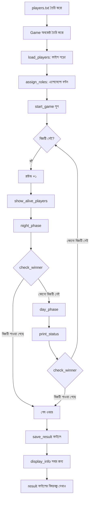

# 🐺 ওয়্যারউলফ গেম সিমুলেটর — সম্পূর্ণ শিক্ষানবিস গাইড

> এই ডকুমেন্টটি ওয়্যারউলফ গেম সিমুলেটরের **প্রত্যেকটি লাইন** ব্যাখ্যা করে।
> এটি পড়ার পর আপনি বুঝতে পারবেন প্রতিটি ক্লাস কী করে, প্রতিটি মেথড কী করে,
> প্রতিটি লাইন কী করে, এবং পুরো গেমটি শুরু থেকে শেষ পর্যন্ত কীভাবে চলে।

---

## সূচিপত্র

1. [এই প্রোগ্রামটি কী করে (সংক্ষিপ্ত বিবরণ)](#১-এই-প্রোগ্রামটি-কী-করে-সংক্ষিপ্ত-বিবরণ)
2. [গেমের গল্প (পাইপলাইন)](#২-গেমের-গল্প-পাইপলাইন)
3. [ব্যবহৃত মডিউল](#৩-ব্যবহৃত-মডিউল)
4. [প্লেয়ার ক্লাস — লাইন বাই লাইন](#৪-প্লেয়ার-ক্লাস--লাইন-বাই-লাইন)
5. [গেম ক্লাস — লাইন বাই লাইন](#৫-গেম-ক্লাস--লাইন-বাই-লাইন)
6. [মূল এক্সিকিউশন কোড — লাইন বাই লাইন](#৬-মূল-এক্সিকিউশন-কোড--লাইন-বাই-লাইন)
7. [ফাইল হ্যান্ডলিং](#৭-ফাইল-হ্যান্ডলিং)
8. [বিশেষ ইভেন্ট ব্যাখ্যা](#৮-বিশেষ-ইভেন্ট-ব্যাখ্যা)
9. [সম্পূর্ণ এক্সিকিউশন ফ্লো (ওয়াকথ্রু)](#৯-সম্পূর্ণ-এক্সিকিউশন-ফ্লো-ওয়াকথ্রু)

---

## ১. এই প্রোগ্রামটি কী করে (সংক্ষিপ্ত বিবরণ)

এটি "ওয়্যারউলফ" (যা "মাফিয়া" নামেও পরিচিত) পার্টি গেমটির একটি **টেক্সট-ভিত্তিক সিমুলেশন**।

- গ্রামে **৮ জন খেলোয়াড়** আছে।
- **২ জন খেলোয়াড়** গোপনে **ওয়্যারউলফ**। বাকি **৬ জন** হল **গ্রামবাসী**।
- প্রতিটি রাউন্ডে দুটি পর্ব আছে:
  - **রাত**: ওয়্যারউলফরা গোপনে একজন গ্রামবাসীকে হত্যা করে।
  - **দিন**: গ্রামবাসীরা একজন খেলোয়াড়কে ভোট দিয়ে বাদ দেয় (তারা জানে না কে ওয়্যারউলফ)।
- গেম শেষ হয় যখন:
  - **গ্রামবাসীদের জয়**: উভয় ওয়্যারউলফকে বাদ দেওয়া হয়।
  - **ওয়্যারউলফদের জয়**: ওয়্যারউলফের সংখ্যা গ্রামবাসীর সংখ্যার সমান বা বেশি হয়।

প্রোগ্রামটি একটি ফাইল (`players.txt`) থেকে খেলোয়াড়ের নাম পড়ে, পুরো গেমটি স্বয়ংক্রিয়ভাবে সিমুলেট করে, এবং ফলাফল অন্য একটি ফাইলে (`game_result.txt`) লেখে।

---

## ২. গেমের গল্প (পাইপলাইন)

এখানে গেমটি কীভাবে চলে তার **ধাপে ধাপে পাইপলাইন** দেওয়া হল:

```
┌─────────────────────────────────────────────┐
│  ধাপ ১: ৮টি নাম দিয়ে players.txt তৈরি করো   │
├─────────────────────────────────────────────┤
│  ধাপ ২: একটি Game অবজেক্ট তৈরি করো           │
├─────────────────────────────────────────────┤
│  ধাপ ৩: ফাইল থেকে মেমরিতে খেলোয়াড় লোড করো  │
├─────────────────────────────────────────────┤
│  ধাপ ৪: এলোমেলোভাবে ভূমিকা বণ্টন করো         │
│           (২টি ওয়্যারউলফ, ৬টি গ্রামবাসী)    │
├─────────────────────────────────────────────┤
│  ধাপ ৫: মূল গেম লুপ শুরু করো                 │
│           ┌──────────────────────────┐      │
│           │  রাউন্ড N শুরু           │      │
│           ├──────────────────────────┤      │
│           │  জীবিত খেলোয়াড় দেখাও   │      │
│           ├──────────────────────────┤      │
│           │  রাতের পর্ব              │      │
│           │    - ওয়্যারউলফ একজন     │      │
│           │      গ্রামবাসী বাছাই করে │      │
│           │    - ১০% সুযোগ: লাকি     │      │
│           │      এস্কেপ (কোয় মরে না)│      │
│           ├──────────────────────────┤      │
│           │  চেক করো গেম শেষ কিনা   │      │
│           ├──────────────────────────┤      │
│           │  দিনের পর্ব              │      │
│           │    - ১৫% সুযোগ:         │      │
│           │      মিস্ট্রিয়াস ক্লু   │      │
│           │      (একটি উলফ বাদ দাও) │      │
│           │    - না হলে: এলোমেলো     │      │
│           │      খেলোয়াড় ভোটে বাদ  │      │
│           ├──────────────────────────┤      │
│           │  স্ট্যাটাস দেখাও (গণনা)  │      │
│           ├──────────────────────────┤      │
│           │  চেক করো গেম শেষ কিনা   │      │
│           └──────────────────────────┘      │
│           ↑ যতক্ষণ না বিজয়ী পাওয়া যায় ↑ │
├─────────────────────────────────────────────┤
│  ধাপ ৬: বিজয়ী ঘোষণা করো                    │
├─────────────────────────────────────────────┤
│  ধাপ ৭: game_result.txt-এ ফলাফল সেভ করো     │
├─────────────────────────────────────────────┤
│  ধাপ ৮: সবার ভূমিকা প্রকাশ করো              │
├─────────────────────────────────────────────┤
│  ধাপ ৯: game_result.txt-এর বিষয়বস্তু দেখাও │
└─────────────────────────────────────────────┘
```

### ভিজুয়াল ফ্লো ডায়াগ্রাম



---

## ৩. ব্যবহৃত মডিউল

### `random`

```python
import random
```

এটি পাইথনের বিল্ট-ইন মডিউল যা র্যান্ডম সংখ্যা তৈরি করে এবং এলোমেলো পছন্দ করে। আমরা এটি ব্যবহার করি:

| ফাংশন                    | এটি কী করে                                            | কোথায় ব্যবহৃত হয়                             |
| ------------------------ | ----------------------------------------------------- | ---------------------------------------------- |
| `random.shuffle(list)`   | একটি লিস্টকে এলোমেলোভাবে সাজায়                       | ভূমিকা বণ্টনের সময়                            |
| `random.choice(list)`    | একটি লিস্ট থেকে এলোমেলো একটি আইটেম বাছাই করে          | আক্রমণের টার্গেট বাছাই, ভোটের সন্দেহভাজন বাছাই |
| `random.randint(1, 100)` | ১ থেকে ১০০-এর মধ্যে একটি এলোমেলো পূর্ণসংখ্যা তৈরি করে | ইভেন্টের সম্ভাবনা চেক করা (১০%, ১৫%)           |

---

## ৪. প্লেয়ার ক্লাস — লাইন বাই লাইন

`Player` ক্লাসটি **একক খেলোয়াড়ের ব্লুপ্রিন্ট**। প্রতিটি খেলোয়াড় একটি "অবজেক্ট" যার একটি নাম, একটি ভূমিকা এবং একটি অবস্থা (জীবিত বা মৃত) থাকে।

### ক্লাস ডিক্লারেশন

```python
class Player:
```

এই লাইনটি বলে: "আমরা একটি নতুন ধরনের অবজেক্ট তৈরি করছি যার নাম `Player`।"

### `__init__` মেথড (কনস্ট্রাক্টর)

```python
def __init__(self, name, role):
```

| অংশ        | অর্থ                                                                                                        |
| ---------- | ----------------------------------------------------------------------------------------------------------- |
| `def`      | আমরা একটি ফাংশন/মেথড সংজ্ঞায়িত করছি                                                                        |
| `__init__` | এটি একটি বিশেষ মেথড যা স্বয়ংক্রিয়ভাবে চলে যখন আমরা একটি নতুন `Player` তৈরি করি। একে **কনস্ট্রাক্টর** বলে। |
| `self`     | আমরা এই মুহূর্তে যে নির্দিষ্ট প্লেয়ার অবজেক্টটি তৈরি করছি সেটিকে নির্দেশ করে                               |
| `name`     | খেলোয়াড়ের নাম (যেমন `"আলিফ"`), প্লেয়ার তৈরি করার সময় পাঠানো হয়                                         |
| `role`     | খেলোয়াড়ের ভূমিকা (যেমন `"Werewolf"`), প্লেয়ার তৈরি করার সময় পাঠানো হয়                                  |

```python
        self.name = name
```

**এটি কী করে:** খেলোয়াড়ের নাম অবজেক্টের ভিতরে সংরক্ষণ করে। `self.name` মানে "এই নির্দিষ্ট খেলোয়াড়ের নাম।" সুতরাং যদি আমরা `Player("আলিফ", "Villager")` তৈরি করি, তাহলে `self.name` হয়ে যায় `"আলিফ"`।

```python
        self.role = role
```

**এটি কী করে:** খেলোয়াড়ের ভূমিকা অবজেক্টের ভিতরে সংরক্ষণ করে।

```python
        self.alive = True
```

**এটি কী করে:** প্রতিটি খেলোয়াড় **জীবিত** অবস্থায় শুরু করে। এটি একটি বুলিয়ান ভেরিয়েবল (True/False)। যখন একজন খেলোয়াড় বাদ পড়ে, তখন এটি `False`-এ পরিবর্তিত হয়।

---

### `display_info` মেথড

```python
    def display_info(self):
```

| অংশ            | অর্থ                                                                 |
| -------------- | -------------------------------------------------------------------- |
| `def`          | একটি মেথড সংজ্ঞায়িত করছি                                            |
| `display_info` | মেথডটির নাম                                                          |
| `self`         | এই মেথডটি যে প্লেয়ার অবজেক্টের উপর কল করা হয়েছে সেটিকে নির্দেশ করে |

```python
        status = "Alive"
```

**এটি কী করে:** `status` নামে একটি ভেরিয়েবল তৈরি করে এবং ডিফল্টভাবে `"Alive"` সেট করে।

```python
        if self.alive == False:
            status = "Eliminated"
```

**এটি কী করে:** চেক করে খেলোয়াড়টি মৃত কিনা। `==` অপারেটর সমতা পরীক্ষা করে। যদি `self.alive` `False` হয়, তাহলে `status`-কে `"Eliminated"`-এ পরিবর্তন করে।

```python
        print(self.name + " - " + self.role + " (" + status + ")")
```

**এটি কী করে:** একটি লাইন প্রিন্ট করে যেমন `"আলিফ - Villager (Alive)"`। `+` অপারেটর স্ট্রিংগুলোকে জোড়া দেয় (কনক্যাটেনেট করে)।

**আউটপুটের উদাহরণ:** `আলিফ - Werewolf (Eliminated)`

---

### `eliminate` মেথড

```python
    def eliminate(self):
```

**এটি কী করে:** `eliminate` নামে একটি মেথড সংজ্ঞায়িত করে যা এই খেলোয়াড়কে "মেরে ফেলবে"।

```python
        self.alive = False
```

**এটি কী করে:** খেলোয়াড়ের `alive` অবস্থা `True` থেকে `False`-এ পরিবর্তন করে। এইভাবেই আমরা একজন খেলোয়াড়কে মৃত হিসেবে চিহ্নিত করি।

```python
        print(self.name + " has been eliminated.")
```

**এটি কী করে:** বাদ পড়ার বার্তা প্রিন্ট করে। উদাহরণ: `"আলিফ has been eliminated."`

---

## ৫. গেম ক্লাস — লাইন বাই লাইন

`Game` ক্লাসটি **পুরো প্রোগ্রামের মস্তিষ্ক**। এটি সবকিছু নিয়ন্ত্রণ করে: খেলোয়াড় লোড করা, ভূমিকা বণ্টন, পর্ব চালানো, বিজয়ী চেক করা এবং ফলাফল সংরক্ষণ করা।

### `__init__` মেথড (কনস্ট্রাক্টর)

```python
class Game:
    def __init__(self):
        self.players = []
        self.round_number = 0
        self.eliminated_order = []
```

| লাইন                         | এটি কী করে                                                                                            |
| ---------------------------- | ----------------------------------------------------------------------------------------------------- |
| `self.players = []`          | সব Player অবজেক্ট সংরক্ষণের জন্য একটি **খালি লিস্ট** তৈরি করে। আমরা পরে ফাইল পড়ার সময় এটি পূরণ করব। |
| `self.round_number = 0`      | রাউন্ড কাউন্টার ০ থেকে শুরু করে। এটি প্রতিটি রাউন্ডে ১ করে বাড়ে।                                     |
| `self.eliminated_order = []` | একটি খালি লিস্ট তৈরি করে যা বাদ পড়া খেলোয়াড়们的 নাম **যে ক্রমে বাদ পড়েছে সে ক্রমে** সংরক্ষণ করবে। |

---

### `load_players` মেথড

```python
    def load_players(self, filename):
```

**উদ্দেশ্য:** একটি টেক্সট ফাইল থেকে খেলোয়াড়ের নাম পড়ে এবং প্রতিটি নামের জন্য `Player` অবজেক্ট তৈরি করে।

```python
        print("Loading players from " + filename + "...")
```

**এটি কী করে:** একটি স্ট্যাটাস বার্তা প্রিন্ট করে যাতে ব্যবহারকারী জানতে পারে কী happening।

```python
        file = open(filename, "r")
```

**এটি কী করে:** ফাইলটি **রিড মোডে** (`"r"`) খোলে। `file` ভেরিয়েবলটি এখন ডিস্কের ফাইলের সাথে একটি সংযোগ ধারণ করে।

```python
        for line in file:
```

**এটি কী করে:** একটি `for` লুপ যা ফাইলটি **এক লাইন করে** পড়ে। প্রতি বার লুপে, `line`-এ ফাইল থেকে একটি লাইন থাকে (যেমন `"আলিফ\n"`)।

```python
            name = line.strip()
```

**এটি কী করে:** `.strip()` লাইন থেকে অতিরিক্ত স্পেস এবং বিশেষ করে নিউলাইন ক্যারেক্টার (`\n`) সরিয়ে দেয়। সুতরাং `"আলিফ\n"` হয়ে যায় `"আলিফ"`।

```python
            if name != "":
```

**এটি কী করে:** খালি লাইন এড়িয়ে যায়। যদি ফাইলে একটি ফাঁকা লাইন থাকে, আমরা তা উপেক্ষা করি।

```python
                player = Player(name, "Unassigned")
```

**এটি কী করে:** প্রদত্ত নাম এবং একটি অস্থায়ী ভূমিকা `"Unassigned"` দিয়ে একটি **নতুন Player অবজেক্ট** তৈরি করে। ভূমিকা পরে সঠিকভাবে সেট করা হবে।

```python
                self.players.append(player)
```

**এটি কী করে:** নতুন তৈরি Player অবজেক্টটিকে `self.players` লিস্টে যোগ করে। `.append()` একটি আইটেমকে লিস্টের শেষে যুক্ত করে।

```python
        file.close()
```

**এটি কী করে:** ফাইলটি বন্ধ করে। ফাইল পড়া শেষ হলে বন্ধ করা গুরুত্বপূর্ণ।

```python
        print("Loaded " + str(len(self.players)) + " players.")
```

**এটি কী করে:** কতজন খেলোয়াড় লোড করা হয়েছে তা প্রিন্ট করে। `len()` একটি লিস্টে কতটি আইটেম আছে তা ফেরত দেয়। `str()` সংখ্যাটিকে স্ট্রিং-এ রূপান্তর করে যাতে এটি প্রিন্ট করা যায়।

---

### `assign_roles` মেথড

```python
    def assign_roles(self):
```

**উদ্দেশ্য:** এলোমেলোভাবে ২ জন খেলোয়াড়কে ওয়্যারউলফ হিসেবে বাছাই করা। বাকি সবাই গ্রামবাসী হয়।

```python
        print("\nAssigning roles randomly...")
```

**এটি কী করে:** একটি বার্তা প্রিন্ট করে। `\n` বার্তার আগে একটি খালি লাইন যোগ করে।

```python
        shuffled = list(self.players)
```

**এটি কী করে:** প্লেয়ার লিস্টের একটি **কপি** তৈরি করে। `list()` একই আইটেম সহ একটি নতুন লিস্ট তৈরি করে। আমরা এটি কপি করি কারণ `shuffle` লিস্টটি পরিবর্তন করে এবং আমরা মূল ক্রমটি রাখতে চাই।

```python
        random.shuffle(shuffled)
```

**এটি কী করে:** কপিকৃত লিস্টটিকে এলোমেলোভাবে পুনর্বিন্যাস করে (শাফল)। এর পরে, খেলোয়াড়রা এলোমেলো ক্রমে থাকে।

```python
        for i in range(len(shuffled)):
```

**এটি কী করে:** একটি লুপ যা শাফল করা লিস্টের প্রতিটি ইনডেক্সের মধ্য দিয়ে যায়। `range(len(shuffled))` সংখ্যা `0, 1, 2, 3, 4, 5, 6, 7` তৈরি করে (৮ জন খেলোয়াড়ের জন্য)।

```python
            if i < 2:
                shuffled[i].role = "Werewolf"
            else:
                shuffled[i].role = "Villager"
```

**এটি কী করে:**

- যদি ইনডেক্স (`i`) ০ বা ১ হয়, সেই খেলোয়াড় ওয়্যারউলফ হয়।
- যদি ইনডেক্স ২ বা তার বেশি হয়, সেই খেলোয়াড় গ্রামবাসী হয়।
- যেহেতু লিস্টটি শাফল করা হয়েছে, ২ জন ওয়্যারউলফ এলোমেলোভাবে বাছাই করা হয়।

```python
        print("Roles have been assigned. (Shh... it's a secret!)")
```

**এটি কী করে:** নিশ্চিত করে যে ভূমিকা নির্ধারণ করা হয়েছে। ভূমিকাগুলো গোপন — প্রোগ্রাম শেষ পর্যন্ত সেগুলো দেখায় না।

---

### `get_alive_players` মেথড (হেলপার)

```python
    def get_alive_players(self):
        alive_list = []
        for player in self.players:
            if player.alive == True:
                alive_list.append(player)
        return alive_list
```

| লাইন                          | এটি কী করে                                                 |
| ----------------------------- | ---------------------------------------------------------- |
| `alive_list = []`             | জীবিত খেলোয়াড় সংগ্রহ করার জন্য একটি খালি লিস্ট তৈরি করে। |
| `for player in self.players:` | গেমের **প্রত্যেক** খেলোয়াড়ের মধ্য দিয়ে লুপ চালায়।      |
| `if player.alive == True:`    | চেক করে এই খেলোয়াড়টি এখনও জীবিত কিনা।                    |
| `alive_list.append(player)`   | যদি জীবিত হয়, তাহলে আমাদের রেজাল্ট লিস্টে যোগ করে।        |
| `return alive_list`           | যে কেউ এই মেথডটি কল করেছে তার কাছে লিস্টটি পাঠিয়ে দেয়।   |

---

### `count_alive_by_role` মেথড (হেলপার)

```python
    def count_alive_by_role(self, role):
        count = 0
        for player in self.players:
            if player.alive == True and player.role == role:
                count = count + 1
        return count
```

| লাইন                                               | এটি কী করে                                                                                                      |
| -------------------------------------------------- | --------------------------------------------------------------------------------------------------------------- |
| `count = 0`                                        | কাউন্টার শূন্য থেকে শুরু করে।                                                                                   |
| `for player in self.players:`                      | প্রতিটি খেলোয়াড় চেক করে।                                                                                      |
| `if player.alive == True and player.role == role:` | দুটি শর্ত অবশ্যই সত্য হতে হবে: (১) খেলোয়াড় জীবিত, এবং (২) খেলোয়াড়ের ভূমিকা আমরা যা গণনা করছি তার সাথে মেলে। |
| `count = count + 1`                                | যখন একটি মিল পাওয়া যায়, কাউন্টার ১ বাড়িয়ে দেয়।                                                             |
| `return count`                                     | চূড়ান্ত সংখ্যা ফেরত দেয়।                                                                                      |

**উদাহরণ:** `self.count_alive_by_role("Werewolf")` ফেরত দেয় `2` যদি উভয় ওয়্যারউলফ এখনও জীবিত থাকে।

---

### `show_alive_players` মেথড

```python
    def show_alive_players(self):
        alive = self.get_alive_players()
        print("\nAlive Players (" + str(len(alive)) + "):")
        for player in alive:
            print("  - " + player.name)
```

| লাইন                               | এটি কী করে                                                              |
| ---------------------------------- | ----------------------------------------------------------------------- |
| `alive = self.get_alive_players()` | জীবিত খেলোয়াড়দের লিস্ট পেতে হেলপার মেথড কল করে।                       |
| `print(...)`                       | কতজন খেলোয়াড় জীবিত আছে তার একটি শিরোনাম প্রিন্ট করে।                  |
| `for player in alive:`             | জীবিত খেলোয়াড়দের মধ্য দিয়ে লুপ চালায়।                               |
| `print("  - " + player.name)`      | প্রতিটি নামের সামনে একটি ড্যাশ দিয়ে প্রিন্ট করে (বুলেট পয়েন্টের মতো)। |

**আউটপুটের উদাহরণ:**

```
Alive Players (6):
  - Alice
  - Bob
  - Charlie
  - David
  - Emma
  - Frank
```

---

### `night_phase` মেথড

এখানেই ওয়্যারউলফরা আক্রমণ করে। আসুন ধাপে ধাপে এটি ভাঙি।

```python
    def night_phase(self):
        print("\n" + "-" * 40)
        print("Night " + str(self.round_number))
        print("The village sleeps...")
        print("-" * 40)
```

| লাইন                                | এটি কী করে                                                                                                                |
| ----------------------------------- | ------------------------------------------------------------------------------------------------------------------------- |
| `"-" * 40`                          | ৪০টি ড্যাশের একটি স্ট্রিং তৈরি করে: `"----------------------------------------"`। এটি ভিজুয়াল বিভাজক হিসেবে ব্যবহৃত হয়। |
| `"Night " + str(self.round_number)` | "Night 1", "Night 2" ইত্যাদি প্রিন্ট করে।                                                                                 |
| `"The village sleeps..."`           | মুড সেট করার জন্য ফ্লেভার টেক্সট।                                                                                         |

#### ধাপ ১: জীবিত ওয়্যারউলফ খুঁজুন

```python
        alive_wolves = []
        for player in self.players:
            if player.alive == True and player.role == "Werewolf":
                alive_wolves.append(player)
```

**এটি কী করে:** সমস্ত খেলোয়াড়ের একটি লিস্ট তৈরি করে যারা **জীবিত** এবং **ওয়্যারউলফ** উভয়ই। এটি "আক্রমণকারীদের" লিস্ট।

#### ধাপ ২: নিরাপত্তা চেক

```python
        if len(alive_wolves) == 0:
            print("No werewolves are alive. The night is peaceful.")
            return
```

**এটি কী করে:** যদি কোনো ওয়্যারউলফ জীবিত না থাকে, তাহলে আক্রমণ করার কেউ নেই। `return` স্টেটমেন্ট মেথড থেকে অবিলম্বে বেরিয়ে যায়।

#### ধাপ ৩: জীবিত গ্রামবাসী খুঁজুন

```python
        alive_villagers = []
        for player in self.players:
            if player.alive == True and player.role == "Villager":
                alive_villagers.append(player)
```

**এটি কী করে:** সমস্ত জীবিত গ্রামবাসীদের একটি লিস্ট তৈরি করে — এরা সম্ভাব্য টার্গেট।

#### ধাপ ৪: নিরাপত্তা চেক

```python
        if len(alive_villagers) == 0:
            print("No villagers left to attack.")
            return
```

**এটি কী করে:** যদি আক্রমণ করার মতো কোনো গ্রামবাসী না থাকে, মেথড থেকে বেরিয়ে যায়।

#### ধাপ ৫: এলোমেলো টার্গেট বাছাই

```python
        target = random.choice(alive_villagers)
```

**এটি কী করে:** লিস্ট থেকে এলোমেলোভাবে একজন গ্রামবাসী বাছাই করতে `random.choice()` ব্যবহার করে। এটিই আক্রমণের টার্গেট।

#### ধাপ ৬: লাকি এস্কেপ চেক

```python
        lucky_chance = random.randint(1, 100)
```

**এটি কী করে:** ১ থেকে ১০০-এর মধ্যে একটি এলোমেলো সংখ্যা তৈরি করে (সহ)। এটি ১০০-পাশা ঘোরানোর মতো।

```python
        if lucky_chance <= 10:
```

**এটি কী করে:** যদি সংখ্যাটি ১০ বা তার কম হয় (১০% সম্ভাবনা), লাকি এস্কেপ ইভেন্ট ট্রিগার হয়।

```python
            print("\n*** Special Event: Lucky Escape! ***")
            print("The target escaped from the Werewolves.")
            print("Nobody dies tonight.")
```

**এটি কী করে:** বিশেষ ইভেন্ট বার্তা প্রিন্ট করে। **টার্গেটকে বাদ দেওয়া হয় না।** কেউ না মরায় রাত শেষ হয়।

```python
        else:
            print("\nWerewolves attacked " + target.name + ".")
            target.eliminate()
            self.eliminated_order.append(target.name)
```

**এটি কী করে (৯০% ক্ষেত্রে):**

1. কাকে আক্রমণ করা হয়েছে তা প্রিন্ট করে।
2. `target.eliminate()` কল করে — এটি `target.alive = False` সেট করে এবং বাদ পড়ার বার্তা প্রিন্ট করে।
3. টার্গেটের নাম `self.eliminated_order`-এ যোগ করে যাতে আমরা বাদ পড়ার ক্রম ট্র্যাক করতে পারি।

---

### `day_phase` মেথড

এখানেই গ্রামবাসীরা কাউকে বাদ দেওয়ার জন্য ভোট দেয়।

```python
    def day_phase(self):
        print("\n" + "-" * 40)
        print("Day " + str(self.round_number))
        print("The village discusses...")
        print("-" * 40)
```

**এটি কী করে:** দিনের পর্বের শিরোনাম বিভাজক সহ প্রিন্ট করে।

```python
        alive = self.get_alive_players()
```

**এটি কী করে:** সমস্ত জীবিত খেলোয়াড়ের লিস্ট পায় (গ্রামবাসী এবং ওয়্যারউলফ উভয়ই)।

```python
        if len(alive) <= 1:
            print("Not enough players for a vote.")
            return
```

**এটি কী করে:** যদি মাত্র ০ বা ১ জন খেলোয়াড় জীবিত থাকে, ভোট দেওয়ার অর্থ হয় না। মেথড থেকে বেরিয়ে যায়।

#### মিস্ট্রিয়াস ক্লু চেক

```python
        clue_chance = random.randint(1, 100)
```

**এটি কী করে:** ১ এবং ১০০-এর মধ্যে একটি এলোমেলো সংখ্যা তৈরি করে।

```python
        if clue_chance <= 15:
```

**এটি কী করে:** যদি সংখ্যাটি ১৫ বা তার কম হয় (১৫% সম্ভাবনা), মিস্ট্রিয়াস ক্লু ইভেন্ট ট্রিগার হয়।

```python
            alive_wolves = []
            for player in alive:
                if player.role == "Werewolf":
                    alive_wolves.append(player)
```

**এটি কী করে:** জীবিত খেলোয়াড়দের তালিকা থেকে সমস্ত জীবিত ওয়্যারউলফ খুঁজে বের করে।

```python
            if len(alive_wolves) > 0:
                caught_wolf = random.choice(alive_wolves)
                print("\n*** Special Event: Mysterious Clue! ***")
                print("The villagers found evidence and eliminated a Werewolf.")
                print("Villagers identified " + caught_wolf.name + " as a Werewolf.")
                caught_wolf.eliminate()
                self.eliminated_order.append(caught_wolf.name)
                return
```

| লাইন                                        | এটি কী করে                                                               |
| ------------------------------------------- | ------------------------------------------------------------------------ |
| `if len(alive_wolves) > 0:`                 | শুধুমাত্র যদি সত্যিই কোনো জীবিত ওয়্যারউলফ থাকে তবেই ট্রিগার করে।        |
| `caught_wolf = random.choice(alive_wolves)` | "ধরা" পড়ার জন্য একটি এলোমেলো ওয়্যারউলফ বাছাই করে।                      |
| তিনটি প্রিন্ট লাইন                          | বিশেষ ইভেন্ট ঘোষণা করে।                                                  |
| `caught_wolf.eliminate()`                   | ধরা পড়া ওয়্যারউলফকে বাদ দেয়।                                          |
| `self.eliminated_order.append(...)`         | বাদ পড়া রেকর্ড করে।                                                     |
| `return`                                    | মেথড থেকে বেরিয়ে যায় — দিনের পর্ব শেষ কারণ একটি ওয়্যারউলফ ধরা পড়েছে। |

#### সাধারণ ভোট

```python
        suspect = random.choice(alive)
```

**এটি কী করে:** যদি মিস্ট্রিয়াস ক্লু ট্রিগার না হয়, যেকোনো জীবিত খেলোয়াড়কে এলোমেলোভাবে সন্দেহভাজন হিসেবে বাছাই করে। (গ্রামবাসীরা জানে না কে নেকড়ে, তাই তারা একজন সহ-গ্রামবাসীকেও ভোট দিতে পারে।)

```python
        print("\nVillagers voted against " + suspect.name + ".")
        print(suspect.name + " was eliminated.")
        suspect.eliminate()
        self.eliminated_order.append(suspect.name)
```

| লাইন                                | এটি কী করে                                   |
| ----------------------------------- | -------------------------------------------- |
| প্রিন্ট                             | কার বিরুদ্ধে ভোট দেওয়া হয়েছে তা ঘোষণা করে। |
| প্রিন্ট                             | বাদ পড়া ঘোষণা করে।                          |
| `suspect.eliminate()`               | সন্দেহভাজনকে মৃত হিসেবে চিহ্নিত করে।         |
| `self.eliminated_order.append(...)` | বাদ পড়ার ক্রমে নাম রেকর্ড করে।              |

---

### `check_winner` মেথড

```python
    def check_winner(self):
        wolf_count = self.count_alive_by_role("Werewolf")
        villager_count = self.count_alive_by_role("Villager")
```

| লাইন                   | এটি কী করে                             |
| ---------------------- | -------------------------------------- |
| `wolf_count = ...`     | কতজন জীবিত ওয়্যারউলফ আছে তা গণনা করে। |
| `villager_count = ...` | কতজন জীবিত গ্রামবাসী আছে তা গণনা করে।  |

```python
        if wolf_count == 0:
            return "Villagers"
```

**এটি কী করে:** যদি কোনো ওয়্যারউলফ জীবিত না থাকে, গ্রামবাসীরা জয়ী হয়! `"Villagers"` স্ট্রিং ফেরত দেয়।

```python
        if wolf_count >= villager_count:
            return "Werewolves"
```

**এটি কী করে:** যদি ওয়্যারউলফের সংখ্যা গ্রামবাসীর সংখ্যার **সমান বা বেশি** হয়, ওয়্যারউলফরা গ্রাম আক্রমণ করে জয়ী হয়।

```python
        return None
```

**এটি কী করে:** যদি কোনো শর্ত পূরণ না হয়, গেম চলতে থাকে। `None` ফেরত দেয় (পাইথনের "কিছুই না" বা "কোনো ফলাফল নেই" বলার উপায়)।

---

### `save_result` মেথড

```python
    def save_result(self, winner):
        print("\nSaving results to game_result.txt...")
        alive = self.get_alive_players()
        surviving_names = []
        for player in alive:
            surviving_names.append(player.name)
```

**এটি কী করে:**

1. সমস্ত জীবিত (বেঁচে থাকা) খেলোয়াড় পায়।
2. শুধু তাদের নামের একটি লিস্ট তৈরি করে।

```python
        file = open("game_result.txt", "w")
```

**এটি কী করে:** `game_result.txt` ফাইলটি **রাইট মোডে** (`"w"`) খোলে। যদি ফাইলটি না থাকে, এটি তৈরি করে। যদি থাকে, এটি ওভাররাইট করে।

```python
        file.write("=== WEREWOLF GAME RESULT ===\n")
        file.write("Winner: " + winner + "\n")
        file.write("Total Rounds: " + str(self.round_number) + "\n")
```

**এটি কী করে:** ফাইলে হেডার, বিজয়ী এবং মোট রাউন্ড লেখে। `\n` একটি নতুন লাইন যোগ করে।

```python
        file.write("\n--- Surviving Players ---\n")
        for name in surviving_names:
            file.write(name + " (" + self.get_role_by_name(name) + ")\n")
```

**এটি কী করে:** প্রতিটি বেঁচে থাকা খেলোয়াড়ের নাম এবং ভূমিকা লেখে।

```python
        file.write("\n--- Eliminated Players (in order) ---\n")
        for name in self.eliminated_order:
            file.write(name + "\n")
```

**এটি কী করে:** বাদ পড়া খেলোয়াড়দের যে ক্রমে বাদ পড়েছে সে ক্রমে লেখে।

```python
        file.close()
        print("Results saved successfully!")
```

**এটি কী করে:** ফাইল বন্ধ করে এবং একটি নিশ্চিতকরণ প্রিন্ট করে।

---

### `get_role_by_name` মেথড (হেলপার)

```python
    def get_role_by_name(self, name):
        for player in self.players:
            if player.name == name:
                return player.role
        return "Unknown"
```

**এটি কী করে:** সব খেলোয়াড়ের মধ্যে মিলিত নাম খুঁজে বের করে, তারপর তাদের ভূমিকা ফেরত দেয়। যদি কোনো মিল না পাওয়া যায়, `"Unknown"` ফেরত দেয়।

---

### `print_status` মেথড (হেলপার)

```python
    def print_status(self):
        v_count = self.count_alive_by_role("Villager")
        w_count = self.count_alive_by_role("Werewolf")
        print("\nCurrent Status:")
        print("  Villagers: " + str(v_count))
        print("  Werewolves: " + str(w_count))
```

**এটি কী করে:** কতজন গ্রামবাসী এবং ওয়্যারউলফ জীবিত আছে তার একটি দ্রুত সারসংক্ষেপ প্রিন্ট করে। এটি পাঠককে গেমের অগ্রগতি অনুসরণ করতে সাহায্য করে।

---

### `start_game` মেথড — মূল লুপ

এটি **সবচেয়ে গুরুত্বপূর্ণ মেথড**। এটি পুরো গেমটি পরিচালনা করে।

```python
    def start_game(self):
        print("\n" + "=" * 50)
        print("WEREWOLF GAME SIMULATOR")
        print("=" * 50)
```

**এটি কী করে:** ৫০টি সমান চিহ্ন ব্যবহার করে একটি বড় টাইটেল ব্যানার প্রিন্ট করে।

```python
        winner = None
```

**এটি কী করে:** `winner` নামে একটি ভেরিয়েবল তৈরি করে এবং এটি `None` সেট করে। `None` মানে "এখনও কোনো বিজয়ী নেই।"

```python
        while winner is None:
```

**এটি কী করে:** এটি **গেম লুপ**। এটি ততক্ষণ চলতে থাকে যতক্ষণ `winner` এখনও `None` (কেউ জিতেনি)। `is` চেক করে দুটি জিনিস একই অবজেক্ট কিনা।

```python
            self.round_number = self.round_number + 1
```

**এটি কী করে:** রাউন্ড সংখ্যা ১ বাড়িয়ে দেয়। প্রথম বার: ০ → ১, তারপর ১ → ২, ইত্যাদি।

```python
            print("\n" + "#" * 40)
            print("### Round " + str(self.round_number) + " ###")
            print("#" * 40)
```

**এটি কী করে:** হ্যাশ চিহ্ন দিয়ে একটি রাউন্ড হেডার প্রিন্ট করে।

```python
            self.show_alive_players()
```

**এটি কী করে:** রাউন্ডের শুরুতে সমস্ত জীবিত খেলোয়াড় প্রদর্শন করে।

```python
            self.night_phase()
```

**এটি কী করে:** রাতের পর্ব চালায় (ওয়্যারউলফ আক্রমণ)।

```python
            winner = self.check_winner()
            if winner is not None:
                break
```

| লাইন                           | এটি কী করে                                             |
| ------------------------------ | ------------------------------------------------------ |
| `winner = self.check_winner()` | রাতের পর্বের পরে কেউ জিতেছে কিনা চেক করে।              |
| `if winner is not None:`       | যদি কোনো বিজয়ী থাকে...                                |
| `break`                        | `while` লুপ থেকে সাথে সাথে বেরিয়ে যায়। গেম বন্ধ করে। |

```python
            self.day_phase()
```

**এটি কী করে:** দিনের পর্ব চালায় (গ্রামবাসীরা ভোট দেয়)।

```python
            self.print_status()
```

**এটি কী করে:** গ্রামবাসী বনাম ওয়্যারউলফের বর্তমান সংখ্যা প্রিন্ট করে।

```python
            winner = self.check_winner()
```

**এটি কী করে:** দিনের পর্বের পরে আবার চেক করে কেউ জিতেছে কিনা। যদি `winner` আর `None` না থাকে, `while` লুপ পরবর্তী চেকে শেষ হবে।

#### লুপের পরে — গেম ওভার

```python
        print("\n" + "=" * 50)
        print("GAME OVER!")
        print("Winner: " + winner.upper())
        print("=" * 50)
```

**এটি কী করে:** একটি বড় "GAME OVER!" ব্যানার প্রিন্ট করে। `.upper()` বিজয়ী স্ট্রিংকে বড় হাতের অক্ষরে রূপান্তর করে (যেমন, `"Villagers"` → `"VILLAGERS"`)।

```python
        self.save_result(winner)
```

**এটি কী করে:** গেমের ফলাফল `game_result.txt`-এ সংরক্ষণ করে।

```python
        print("\n--- Final Role Reveal ---")
        for player in self.players:
            player.display_info()
```

**এটি কী করে:** সমস্ত খেলোয়াড়ের মধ্য দিয়ে লুপ চালায় এবং প্রতিটিতে `display_info()` কল করে। এটি সবার ভূমিকা এবং তারা বেঁচে আছে কিনা তা প্রকাশ করে।

---

## ৬. মূল এক্সিকিউশন কোড — লাইন বাই লাইন

এই লাইনগুলি আসলে গেমটি **চালায়** (কোনো ক্লাসের ভিতরে নয়)।

### প্লেয়ার ফাইল তৈরি করা

```python
player_names = [
    "Alice",
    "Bob",
    "Charlie",
    "David",
    "Emma",
    "Frank",
    "Grace",
    "Henry"
]
```

**এটি কী করে:** ৮টি খেলোয়াড়ের নাম ধারণকারী একটি পাইথন লিস্ট তৈরি করে। বর্গাকার বন্ধনী `[...]` একটি লিস্ট তৈরি করে।

```python
file = open("players.txt", "w")
```

**এটি কী করে:** `players.txt` ফাইলটি **রাইট মোডে** (`"w"`) খোলে। ফাইলটি না থাকলে তৈরি করে।

```python
for name in player_names:
    file.write(name + "\n")
```

**এটি কী করে:** প্রতিটি নামের মধ্য দিয়ে লুপ চালায় এবং ফাইলে নামটি লেখে, তারপরে একটি নিউলাইন ক্যারেক্টার (`\n`) থাকে। এই লুপের পরে, ফাইলটি দেখতে এমন হয়:

```
Alice
Bob
Charlie
...
```

```python
file.close()
```

**এটি কী করে:** ফাইলটি বন্ধ করে।

---

### গেম চালানো

```python
game = Game()
```

**এটি কী করে:** একটি নতুন `Game` অবজেক্ট তৈরি করে। এটি `__init__` মেথড কল করে, যা খালি প্লেয়ার লিস্ট, রাউন্ড ০ এবং খালি এলিমিনেশন অর্ডার সেট আপ করে।

```python
game.load_players("players.txt")
```

**এটি কী করে:** আমাদের `game` অবজেক্টে `load_players` মেথড কল করে। `players.txt` পড়ে এবং ৮টি `Player` অবজেক্ট তৈরি করে।

```python
game.assign_roles()
```

**এটি কী করে:** `assign_roles` কল করে। এলোমেলোভাবে ২ জন খেলোয়াড়কে ওয়্যারউলফ এবং বাকিদের গ্রামবাসী বানায়।

```python
game.start_game()
```

**এটি কী করে:** মূল গেম লুপ শুরু করে। এটি ততক্ষণ চলে যতক্ষণ না কেউ জেতে, তারপর ফলাফল সংরক্ষণ করে এবং ভূমিকা প্রকাশ করে।

---

### ফলাফল প্রদর্শন

```python
print("=" * 50)
print("CONTENTS OF game_result.txt")
print("=" * 50)
```

**এটি কী করে:** ফলাফল প্রদর্শনের জন্য একটি হেডার প্রিন্ট করে।

```python
result_file = open("game_result.txt", "r")
```

**এটি কী করে:** রেজাল্ট ফাইলটি রিড মোডে (`"r"`) খোলে।

```python
for line in result_file:
    print(line, end="")
```

**এটি কী করে:** প্রতিটি লাইন পড়ে এবং প্রিন্ট করে। `end=""` `print()`-কে অতিরিক্ত নিউলাইন না যোগ করতে বলে, কারণ ফাইলের প্রতিটি লাইন ইতিমধ্যেই `\n` দিয়ে শেষ হয়।

```python
result_file.close()
```

**এটি কী করে:** ফাইলটি বন্ধ করে।

---

## ৭. ফাইল হ্যান্ডলিং

### ইনপুট ফাইল: `players.txt`

- **তৈরি করে:** "Create Players File" কোড সেল
- **ফরম্যাট:** প্রতি লাইনে একটি নাম
- **উদাহরণ:**
  ```
  Alice
  Bob
  Charlie
  David
  Emma
  Frank
  Grace
  Henry
  ```
- **পড়ে:** `game.load_players("players.txt")`

### আউটপুট ফাইল: `game_result.txt`

- **তৈরি করে:** `game.save_result(winner)` মেথড `start_game()`-এর সময়
- **ফরম্যাট:**

  ```
  === WEREWOLF GAME RESULT ===
  Winner: Werewolves
  Total Rounds: 4

  --- Surviving Players ---
  Charlie (Villager)
  Grace (Werewolf)

  --- Eliminated Players (in order) ---
  Alice
  Emma
  Frank
  Henry
  Bob
  David
  ```

### ফাইল মোডের সারসংক্ষেপ

| মোড   | অর্থ                       | ব্যবহার                                               |
| ----- | -------------------------- | ----------------------------------------------------- |
| `"r"` | পড়া (Read)                | `players.txt` পড়া, `game_result.txt` পড়া            |
| `"w"` | লেখা (Write, ওভাররাইট করে) | `players.txt` তৈরি করা, `game_result.txt` সংরক্ষণ করা |

---

## ৮. বিশেষ ইভেন্ট ব্যাখ্যা

### ইভেন্ট ১: লাকি এস্কেপ (Lucky Escape)

| বৈশিষ্ট্য     | মান                                                                              |
| ------------- | -------------------------------------------------------------------------------- |
| **কখন?**      | রাতের পর্বের সময়                                                                |
| **সম্ভাবনা?** | ১০% (১-১০০-এর মধ্যে এলোমেলো সংখ্যা, ≤ ১০ হলে ট্রিগার)                            |
| **কী হয়?**   | ওয়্যারউলফরা যে গ্রামবাসীকে টার্গেট করেছিল সে পালিয়ে যায়। সেই রাতে কেউ মরে না। |
| **কোড চেক:**  | `if lucky_chance <= 10:`                                                         |

### ইভেন্ট ২: মিস্ট্রিয়াস ক্লু (Mysterious Clue)

| বৈশিষ্ট্য          | মান                                                               |
| ------------------ | ----------------------------------------------------------------- |
| **কখন?**           | দিনের পর্বের সময়                                                 |
| **সম্ভাবনা?**      | ১৫% (১-১০০-এর মধ্যে এলোমেলো সংখ্যা, ≤ ১৫ হলে ট্রিগার)             |
| **কী হয়?**        | গ্রামবাসীরা প্রমাণ পায় এবং সরাসরি একটি ওয়্যারউলফকে বাদ দেয়।    |
| **কোড চেক:**       | `if clue_chance <= 15:`                                           |
| **অতিরিক্ত শর্ত:** | কমপক্ষে একজন জীবিত ওয়্যারউলফ থাকতে হবে (`len(alive_wolves) > 0`) |

---

## ৯. সম্পূর্ণ এক্সিকিউশন ফ্লো (ওয়াকথ্রু)

আসুন গেমটি কীভাবে চলে তার একটি **বাস্তব উদাহরণ** ট্রেস করি, ধাপে ধাপে।

### সেটআপ ফেজ

```
১. পাইথন উপরে থেকে নিচে নোটবুক এক্সিকিউট করা শুরু করে।
২. import random          → র্যান্ডম ফাংশন উপলব্ধ করে
৩. class Player:          → প্লেয়ার ব্লুপ্রিন্ট সংজ্ঞায়িত করে
৪. class Game:            → গেম ব্লুপ্রিন্ট সংজ্ঞায়িত করে
৫. player_names = [...]   → ৮টি নামের লিস্ট তৈরি করে
৬. Open players.txt (w)   → ইনপুট ফাইল তৈরি করে
৭. Write 8 names          → ফাইলে এখন ৮টি লাইন আছে
৮. Close file             → ফাইল ডিস্কে সংরক্ষিত
৯. game = Game()          → গেম অবজেক্ট তৈরি করে:
                              - self.players = []
                              - self.round_number = 0
                              - self.eliminated_order = []
```

### গেম এক্সিকিউশন ফেজ

```
১০. game.load_players("players.txt")
    → players.txt পড়ার জন্য খোলে
    → "Alice" পড়ে, Player("Alice", "Unassigned") তৈরি করে, লিস্টে যোগ করে
    → "Bob" পড়ে, Player("Bob", "Unassigned") তৈরি করে, লিস্টে যোগ করে
    → ... (৮টি নামের জন্য পুনরাবৃত্তি)
    → ফাইল বন্ধ করে
    → প্রিন্ট করে "Loaded 8 players."

১১. game.assign_roles()
    → প্লেয়ার লিস্ট কপি করে
    → এলোমেলোভাবে শাফল করে (যেমন, [Henry, Alice, Grace, Bob, ...])
    → ইনডেক্স ০ (Henry) → Werewolf
    → ইনডেক্স ১ (Alice) → Werewolf
    → ইনডেক্স ২-৭ → Villagers
    → নিশ্চিতকরণ প্রিন্ট করে

১২. game.start_game()
    → "WEREWOLF GAME SIMULATOR" ব্যানার প্রিন্ট করে
    → winner = None
```

### রাউন্ড ১

```
১৩. while winner is None:  → True, তাই লুপে প্রবেশ করে
১৪. round_number = 1
১৫. প্রিন্ট "### Round 1 ###"
১৬. show_alive_players()   → ৮টি নাম দেখায়

১৭. night_phase()
    → প্রিন্ট "Night 1 / The village sleeps..."
    → জীবিত ওয়্যারউলফ খুঁজে: [Henry, Alice]
    → জীবিত গ্রামবাসী খুঁজে: [Bob, Charlie, David, Emma, Frank, Grace]
    → এলোমেলো টার্গেট বাছাই: যেমন, "Frank"
    → lucky_chance = random.randint(1, 100) → যেমন, ৪৭
    → ৪৭ > ১০, তাই সাধারণ আক্রমণ
    → প্রিন্ট "Werewolves attacked Frank."
    → Frank.eliminate() → Frank.alive = False
    → eliminated_order = ["Frank"]

১৮. check_winner()
    → wolf_count = 2, villager_count = 5
    → wolf_count (2) != 0 → গ্রামবাসীদের জয় নয়
    → wolf_count (2) < villager_count (5) → ওয়্যারউলফদের জয় নয়
    → None ফেরত দেয়

১৯. winner এখনও None, তাই চলতে থাকে (কোনো break নয়)

২০. day_phase()
    → প্রিন্ট "Day 1 / The village discusses..."
    → alive = [Alice, Bob, Charlie, David, Emma, Grace, Henry] (৭ জন, Frank বাদ পড়েছে)
    → clue_chance = random.randint(1, 100) → যেমন, ৭২
    → ৭২ > ১৫, তাই কোনো মিস্ট্রিয়াস ক্লু নেই
    → suspect = random.choice(alive) → যেমন, "Bob"
    → প্রিন্ট "Villagers voted against Bob."
    → Bob.eliminate()
    → eliminated_order = ["Frank", "Bob"]

২১. print_status()
    → Villagers: 4, Werewolves: 2

২২. check_winner()
    → wolf_count = 2, villager_count = 4
    → এখনও কোনো বিজয়ী নেই → None ফেরত দেয়

২৩. while winner is None: → এখনও True, তাই লুপ পুনরাবৃত্তি
```

### রাউন্ড ২

```
২৪. round_number = 2
... (একই প্যাটার্ন চলতে থাকে)

এটি পুনরাবৃত্তি হতে থাকে যতক্ষণ না:
- wolf_count == 0     → গ্রামবাসীরা জয়ী
- wolf_count >= villager_count → ওয়্যারউলফরা জয়ী
```

### গেম শেষ ফেজ

```
২৫. winner আর None নেই → while লুপ থেকে বেরিয়ে যায়
২৬. প্রিন্ট "GAME OVER! Winner: WEREWOLVES"
২৭. save_result("Werewolves")
    → বিজয়ী, রাউন্ড, বেঁচে থাকা, বাদ পড়াদের game_result.txt-এ লেখে
২৮. সব খেলোয়াড়ের মধ্য দিয়ে লুপ চালায় এবং display_info() কল করে
    → চূড়ান্ত ভূমিকা প্রকাশ প্রিন্ট করে:
      Alice - Villager (Eliminated)
      Bob - Villager (Eliminated)
      ...
      Grace - Werewolf (Alive)
```

### ফলাফল প্রদর্শন

```
২৯. game_result.txt পড়ার জন্য খোলে
৩০. ফাইলের প্রতিটি লাইন প্রিন্ট করে
৩১. ফাইল বন্ধ করে
```

---

## সারসংক্ষেপ: কীভাবে সবকিছু সংযুক্ত

```
┌──────────────────────────────────────────────────────────┐
│                      প্লেয়ার ক্লাস                       │
│  - সংরক্ষণ করে: name, role, alive                        │
│  - মেথড: display_info(), eliminate()                     │
│  - প্রতিটি খেলোয়াড় একটি Player অবজেক্ট                  │
└──────────────────────┬───────────────────────────────────┘
                       │
                       │ ব্যবহার করে
                       ▼
┌──────────────────────────────────────────────────────────┐
│                       গেম ক্লাস                           │
│  - সংরক্ষণ করে: Player অবজেক্টের লিস্ট, রাউন্ড,          │
│            বাদ পড়ার ক্রম                                 │
│  - load_players()    → ফাইল থেকে Player অবজেক্ট তৈরি     │
│  - assign_roles()    → প্রতিটি খেলোয়াড়ের ভূমিকা সেট    │
│  - night_phase()     → ওয়্যারউলফ আক্রমণ (ইভেন্ট সহ)    │
│  - day_phase()       → গ্রামের ভোট (ইভেন্ট সহ)           │
│  - check_winner()    → গেম শেষ কিনা সিদ্ধান্ত নেয়       │
│  - save_result()     → ফলাফল ফাইলে লেখে                  │
│  - start_game()      → পুরো লুপ পরিচালনা করে              │
└──────────────────────┬───────────────────────────────────┘
                       │
                       │ নিয়ন্ত্রিত
                       ▼
┌──────────────────────────────────────────────────────────┐
│                   মূল এক্সিকিউশন কোড                     │
│  1. players.txt তৈরি করো                                │
│  2. game = Game()                                        │
│  3. game.load_players("players.txt")                     │
│  4. game.assign_roles()                                  │
│  5. game.start_game()          ← সবচেয়ে বড়!            │
│  6. game_result.txt দেখাও                               │
└──────────────────────────────────────────────────────────┘
```

---

> **এটাই!** আপনি এখন ওয়্যারউলফ গেম সিমুলেটরের প্রতিটি লাইন, প্রতিটি মেথড, প্রতিটি ক্লাস এবং সম্পূর্ণ ফ্লো বুঝতে পেরেছেন। এই ডকুমেন্টটি আপনার ভাইভা বা যে কেউ পাইথনে নতুন তাদের ব্যাখ্যা করার জন্য যথেষ্ট হবে।
